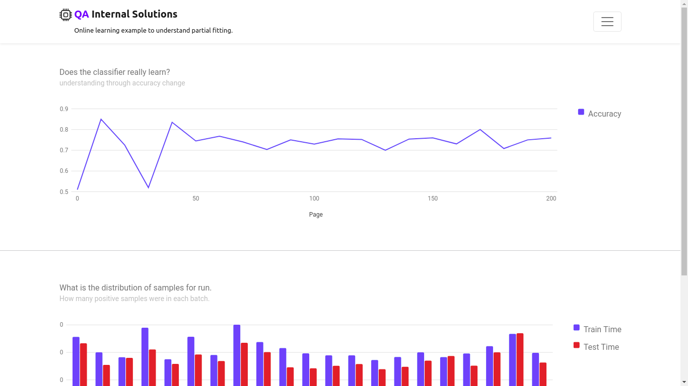

# qais




## Tasks
- run `docker-compose`
- allow pushing data from outside through script
- make an online learning model

## Steps
- ML models and their online learning capabilities
- Created database model
- Translated to SQLAlchemy
- Used RQ to run separately
- automated through docker-compose

[Working pattern](https://github.com/DorenCalliku/qais/issues?q=is%3Aissue)

## Sample environment
```
FLASK_APP=app.py
FLASK_ENV=prod
REDIS_URL=redis://rq-server-interview:6379/0
SECRET_KEY=asdjoias9eedm2093ejoisd
DATABASE_URL=postgresql://not_a_user:not_a_password@db:5432/interview
SQL_HOST=db
SQL_PORT=5432
DATABASE=postgres
```
